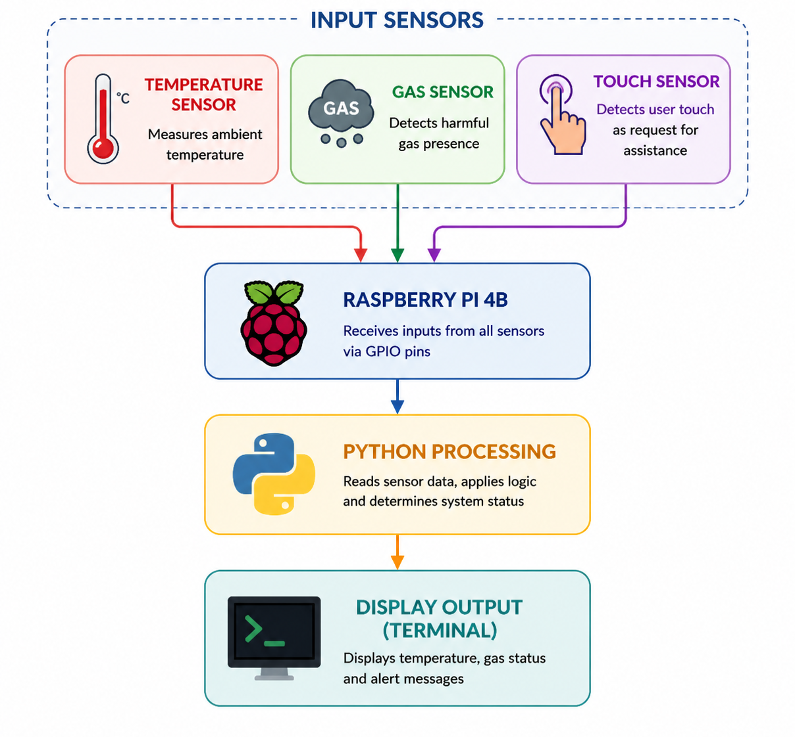
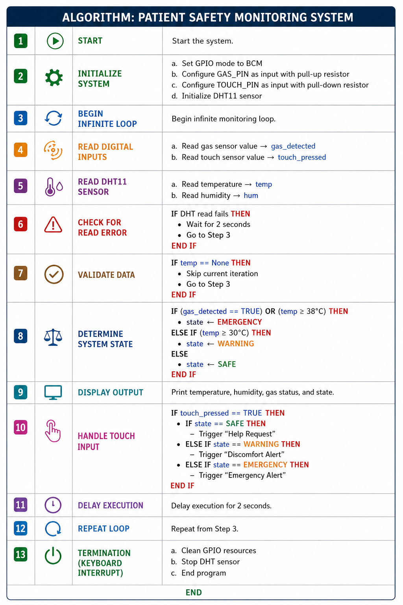
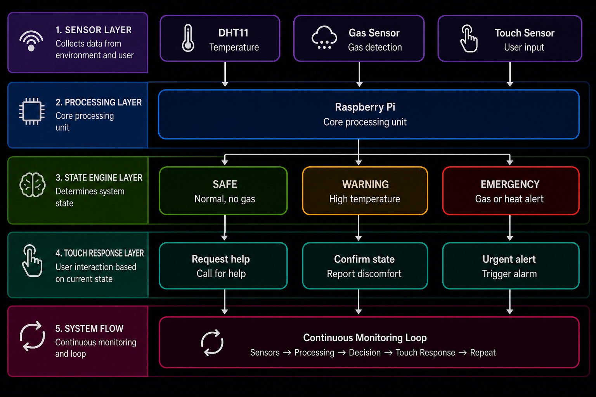
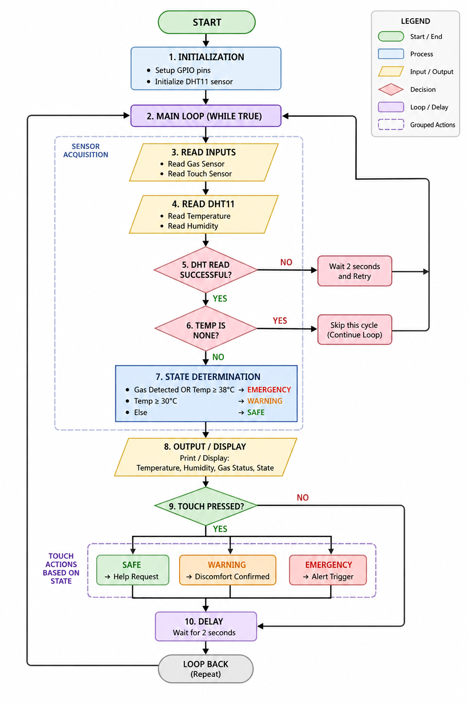

# SKILL LAB PRATICAL HACKATHON

## Final Project README

> **Project Weight:** 100%  
> **Team Size:** 4/3 students  
> **Project Duration:** 16 hours  
> **Total Time Available:** 32 effort-hours per team  
> **Project Type:** Playful, interactive, technology-based experience

---

# Before you begin

## Fork and rename this repository

After forking this repository, rename it using the format:

`SKILLLAB_PROR-2026-TeamName`

### Example

`SKILLLAB_PROR-2026-AuroWizards`

Do not keep the default repository name.

---

# How to use this README

This file is your team’s **working project document**.

You must keep updating it throughout the build period.  
By the final review, this README should clearly show:

- your idea,
- your planning,
- your design decisions,
- your technical process,
- your build progress,
- your testing,
- your failures and changes,
- your final outcome.

## Rules

- Fill every section.
- Do not delete headings.
- If something does not apply, write `Not applicable` and explain why.
- Add images, screenshots, sketches, links, and videos wherever useful.
- Update task status and weekly logs regularly.
- Use this file as evidence of process, not only as a final report.

---

# 1. Team Identity

## 1.1 Studio / Group Name

`Zenith`

## 1.2 Team Members

| Name           | Primary Role                    | Secondary Role     | Strengths Brought to the Project        |
|----------------|--------------------------------|--------------------|-----------------------------------------|
| Aryan Pandey   | Electronics/Coding       | Team Lead          | Leadership, System Integration          |
| Srushti Upase  | Electronics    | GitHub    | Hardware Handling, Documentation        |
| Yash Singh     | Raspberry Pi Setup / Libraries  | Testing            | Software Setup           |
| Omkar Hivrale | GitHub Management | Repository Maintenance | Version Control, Project Monitoring |

## 1.3 Project Title

`"Smart Patient Monitoring System using Raspberry Pi"`

## 1.4 One-Line Pitch

`A smart healthcare system that monitors patient conditions in real-time using temperature, gas, and touch sensors with Raspberry Pi and provides instant alerts for safety.`

## 1.5 Expanded Project Idea

The Smart Patient Monitoring System using Raspberry Pi is designed to continuously monitor the health and safety conditions of a patient in real time. The system uses a temperature sensor to track room temperature, a gas sensor to detect harmful gases or air quality issues, and a touch sensor that can act as an emergency alert button for the patient. All sensors are connected to a Raspberry Pi, which processes the data using Python.

When any abnormal condition is detected, such as high temperature, gas leakage, or when the patient presses the touch sensor, the system displays alert messages directly on the terminal. These messages help indicate the current status of the patient and notify caregivers about potential risks. This project demonstrates a simple and functional patient monitoring system that can be used in hospitals or home care environments. It improves patient safety by enabling timely identification of abnormal conditions and reduces the need for continuous manual monitoring.

# 2. Inspiration

## 2.1 References

| Source Type | Title / Link | What Inspired You |
|------------|-------------|-------------------|
| Research Paper | https://www.ncbi.nlm.nih.gov/pmc/articles/PMC8036577/ | Understanding basic patient monitoring using sensors and real-time data collection |
| Article | https://www.sciencedirect.com/topics/engineering/patient-monitoring-system | Overview of how patient monitoring systems work in healthcare |
| Article | https://www.geeksforgeeks.org/raspberry-pi-introduction/ | Learning how Raspberry Pi can be used for sensor-based projects |
| Real-world | Hospital patient monitoring systems | Need for continuous observation of patient conditions |
| Problem | Delayed response in emergencies | Importance of immediate alert systems for patient safety |

## 2.2 Original Twist

What makes your project original?

**Response:**  
The originality of this project lies in combining both automatic and manual alert mechanisms in a simple monitoring system. While most traditional systems focus only on sensor-based detection, this project also includes a touch sensor that allows the patient to manually request help in case of discomfort or emergency.

Additionally, the system monitors not only patient-related conditions like temperature but also environmental factors such as gas presence, making it more comprehensive. The use of a compact setup with basic sensors and a processing unit makes the system simple to implement while still addressing important real-world healthcare needs.

---

# 3. Project Intent

## 3.1 User Journey 

Describe exactly how a user will use the project.Make it a story
**Response:**  
A patient is resting in bed. If they feel discomfort, they press the touch sensor. A message is then displayed indicating that assistance is required.

The temperature value is continuously displayed, allowing observation of any changes. If needed, this can help in identifying unusual conditions.

The surroundings are also checked for the presence of gas or smoke. If detected, a warning message is displayed to indicate a potential risk.

These displayed messages and readings help caregivers or nearby individuals understand the situation and respond when necessary, without the need for constant supervision.
                                                  

---

# 4. Definition of Success

## 4.1 Definition of “Usable”
The project is considered usable if it can correctly read data from all the connected sensors and display clear messages based on those readings. It should accurately identify normal and abnormal conditions and show the correct output without delay.

The touch sensor should respond immediately when pressed and display the corresponding message. The program should run continuously without stopping and should produce consistent and understandable outputs.

## 4.2 Minimum Usable Version

What is the smallest version of this project that still delivers the core experience?

**Response:**  
The minimum usable version of this project includes basic connections of a temperature sensor, gas sensor, and touch sensor with a program that reads their values.

The program should be able to detect when the temperature exceeds a certain limit, when gas is present, or when the touch sensor is pressed, and display appropriate messages on the screen. Even without additional features, this setup is sufficient to demonstrate real-time sensing and alert indication through simple outputs.

## 4.3 Stretch Features

What features are nice to have but not essential?
- Displaying alerts on a mobile or web interface instead of only on a screen  
- Adding buzzer or LED indicators for instant physical alerts  
- Storing sensor data for future analysis  
- Setting threshold-based automatic alerts for temperature  
- Sending notifications to caregivers using SMS or app integration  
- Making the setup wireless for easier placement

---

# 5. System Overview

## 5.1 Project Type

Check all that apply.

- [x] Electronics-based

- [ ] Mechanical

- [x] Sensor-based

- [ ] App-connected

- [x] Motorized

- [ ] Sound-based

- [ ] Light-based

- [x] Screen/UI-based

- [ ] Fabricated structure

- [ ] Game logic based

- [ ] Installation

- [ ] Other:

## 5.2 High-Level System Description

Explain how the system works in simple terms.

Include:

- input,
- processing,
- output,
- physical structure,
- app interaction if any.

**Response:**  
The project takes input from three sensors: a temperature sensor, a gas sensor, and a touch sensor. These sensors provide real-time data related to environmental conditions and user interaction.

The collected data is processed using a Python program, where the sensor values are read and basic conditions are checked. Based on these readings, appropriate messages are generated.

The output is displayed on a screen in the form of text messages. The temperature value is continuously shown. For the gas sensor, messages such as "Safe" or "Danger" are displayed depending on the detected level. When the touch sensor is pressed, a message indicating "Help Requested" is shown.

The components are connected using basic wiring on a board, forming a simple hardware setup. There is no external application involved, and all interactions are limited to sensor inputs and on-screen outputs.

## 5.3 Input / Output Map

| System Part        | Type   | What It Does |
|------------------|--------|--------------|
| Temperature Sensor | Input  | Measures temperature and displays the value |
| Gas Sensor        | Input  | Detects presence of gas or smoke |
| Touch Sensor      | Input  | Detects user touch as a request for assistance |
| Processing Unit   | Process| Reads sensor data and decides what message to display |
| Display (Screen)  | Output | Shows temperature values and alert messages |

---

# 6. System Design, Sketches and Visual Planning 

## 6.1 Concept Architecture/sketch/schematic

Add an early sketch of the full idea.

**Insert image below:**  

## 6.2 Labeled Build Sketch/architecture/flow diagram/algorithm

Add a sketch with labels showing:

- structure,
- electronics placement,
- user touch points,
- moving parts,
- output elements.

**Insert image below:**  

# 7. Electronics Planning

## 7.1 Electronics Used

| Component              | Quantity | Purpose |
|----------------------|----------|---------|
| Raspberry Pi 4B | 1        | Main processing unit to read sensor data and display output |
| Temperature Sensor     | 1        | Measures temperature and provides continuous readings |
| Gas Sensor             | 1        | Detects presence of gas or smoke |
| Touch Sensor           | 1        | Detects user input for assistance request |
| Jumper Wires           | As required | Used for connecting components |

## 7.2 Wiring Plan

Describe the main electrical connections.

**Response:**  
The sensors are connected to the GPIO pins of the processing unit using jumper wires. Each sensor is provided with proper power (VCC) and ground (GND) connections.

The temperature sensor (DHT11) is connected to GPIO pin 7 to read temperature values. The gas sensor is connected to GPIO pin 17 and provides a digital signal indicating whether gas is detected or not. The touch sensor is connected to GPIO pin 27 and detects user interaction when pressed.

The gas sensor is configured using a pull-up connection, where it gives a LOW signal when gas is detected. The touch sensor uses a pull-down configuration and gives a HIGH signal when touched.

All components share a common ground to ensure stable operation. The sensor data is read through GPIO pins and corresponding messages are displayed on the screen based on the conditions.

## 7.3 Circuit Diagram/architecture diagram

Insert a hand-drawn or software-made circuit diagram.

**Insert image below:**  

# 7.4. Power Plan

| Question         | Response |
|------------------|----------|
| Power source     | Standard 5V power supply (adapter) |
| Voltage required | 5V for the processing unit and sensors |
| Current concerns | Sensors draw low current, but stable power is required for continuous operation |
| Safety concerns  | Ensure proper connections, avoid short circuits, and use a reliable power supply to prevent sudden shutdowns |

---

# 8. Software Planning/

## 8.1 Software Tools

| Tool / Platform | Purpose |
|-----------------|---------|
| Python          | Used to read sensor data and process conditions |
| RPi.GPIO Library| Used for interfacing with GPIO pins |
| Adafruit DHT Library | Used to read temperature from the DHT11 sensor |
| Thonny / Terminal | Used to write and run the program |

## 8.2 Software Logic/Algorithm

Describe what the code must do.

Include:

- startup behavior,
- input handling,
- sensor reading,
- decision logic,
- output behavior,
- communication logic,
- reset behavior.

**Response:**  
**Startup behavior:**
The program initializes all required libraries and configures the GPIO pins for the gas sensor and touch sensor. The temperature sensor is also initialized. A message is displayed indicating that monitoring has started.

**Input handling:**
Inputs are taken from three sensors: gas sensor, touch sensor, and temperature sensor. The gas sensor provides a digital signal, the touch sensor detects user interaction, and the temperature sensor provides temperature readings.

**Sensor reading:**
The program continuously reads the temperature value and checks the status of the gas and touch sensors. If any temporary error occurs while reading the temperature sensor, the program retries after a short delay.

**Decision logic:**
Based on the sensor values, the program determines the current state:
- If gas is detected or temperature is very high → Emergency  
- If temperature is above a certain level → Warning  
- Otherwise → Safe  

**Output behavior:**
The temperature value is displayed continuously. Along with this, the system displays the current status (Safe, Warning, or Emergency). Additional messages are displayed when the touch sensor is pressed, indicating that help is required.

**Communication logic:**
There is no external communication involved. All outputs are displayed locally on the screen.

**Reset behavior:**
The program runs continuously in a loop until it is manually stopped. When stopped, the GPIO pins are cleaned up properly.

## 8.3 Code Flowchart

Insert a flowchart showing your code logic.

Suggested sequence:

- start,
- initialize,
- wait for input,
- read input,
- decision,
- trigger output,
- repeat or reset,
- error handling.

**Insert image below:**  

# 9. Bill of Materials

## 9.1 Full BOM

| Item                     | Quantity | In Kit? | Need to Buy? | Estimated Cost | Material / Spec | Why This Choice? |
|--------------------------|----------|---------|--------------|----------------|------------------|------------------|
| Raspberry Pi 4B   | 1        | Yes     | No           | 0              | 40-pin GPIO board | Used for processing sensor data and running the program |
| Temperature Sensor (DHT11)| 1       | Yes     | No           | 0              | Digital sensor    | Used to measure temperature |
| Gas Sensor (MQ-135)   | 1        | Yes     | No           | 0              | Gas detection sensor | Used to detect gas or smoke |
| Touch Sensor             | 1        | Yes     | No           | 0              | Capacitive touch module | Used for manual input from user |
| Jumper Wires             | As required | Yes  | No           | 0              | Connecting wires  | Used to connect all components |

## 9.2 Material Justification

Explain why you selected your main materials and components.

**Response:**  
The selected components were chosen to create a simple and functional sensor-based setup. The Raspberry Pi 4B is used as the main processing unit because it can easily interface with sensors and run Python programs.
The DHT11 temperature sensor is used for basic temperature measurement, which is sufficient for demonstrating the concept. The gas sensor helps in detecting the presence of harmful gases or smoke in the environment. The touch sensor allows manual input from the user, making it possible to indicate a need for assistance.
Jumper wires are used for easy connections between components. All components are simple to use, easily available, and suitable for demonstrating real-time sensing and output display.

## 9.3 Items You chose

| Item                      | Why Needed                         | Purchase Link | Latest Safe Date to Procure | Status     |
|---------------------------|------------------------------------|---------------|-----------------------------|------------|
| Temperature Sensor (DHT11)| To measure temperature             | Provided in lab | Already available          | Received   |
| Gas Sensor                | To detect gas or smoke             | Provided in lab | Already available          | Received   |
| Touch Sensor              | For manual input (help request)    | Provided in lab | Already available          | Received   |
| Jumper Wires              | For connections                    | Provided in lab | Already available          | Received   |
| Raspberry Pi 4B    | To process data and run code       | Provided in lab | Already available          | Received   |

## 9.4 Budget Summary

| Budget Item        | Estimated Cost |
|-------------------|----------------|
| Electronics       | 0              |
| Mechanical parts  | 0              |
| Fabrication materials | 0          |
| Purchased extras  | 0              |
| Contingency       | 0              |
| **Total**         | 0              |

## 9.5 Budget Reflection

If your cost is too high, what can be simplified, removed, substituted, or shared?

**Response:**  
Since all components used in this project were already available in the lab kit, no additional cost was required. If needed, the project can be simplified further by using fewer sensors or substituting components with similar alternatives. Components can also be shared among multiple groups to reduce cost.

---

# 10. Planning the Work

## 10.1 Team Working Agreement

Write how your team will work together.

Include:

- how tasks are divided,
- how decisions are made,
- how progress will be checked,
- what happens if a task is delayed,
- how documentation will be maintained.

**Response:**  
The team followed a structured and collaborative approach with clearly defined roles and responsibilities.

Task division was done based on individual strengths. Aryan Pandey led the team and was responsible for implementing the project, including handling sensor connections and overall integration. Srushti Upase assisted in the implementation and managed the GitHub repository, ensuring proper documentation. Yash Singh was responsible for setting up the software environment, including installation and configuration of required libraries. Omkar Hivrale handled progress tracking and regularly uploaded updates on GitHub.

Decisions were made collectively through discussion among all team members to ensure clarity and agreement. Progress was reviewed regularly to monitor task completion and maintain steady workflow.

In case of delays, responsibilities were adjusted and team members supported each other to complete pending work on time. Documentation was maintained continuously on GitHub, ensuring that all changes and progress were properly recorded.

## 10.2 Task Breakdown
| Task ID | Task                          | Owner            | Estimated Hours | Deadline | Dependency | Status   |
|---------|-------------------------------|------------------|-----------------|----------|------------|----------|
| T1      | Finalize project concept      | All              | 1               | 2nd May  | None       | Done     |
| T2      | Sensor connections setup      | Aryan            | 2               | 2nd May  | T1         | Done     |
| T3      | Python code implementation    | Aryan, Srushti   | 4               | 2nd May  | T2         | Done     |
| T4      | Library installation setup    | Yash             | 2               | 2nd May  | T2         | Done     |
| T5      | Testing and debugging         | Aryan, Srushti   | 3               | 2nd May  | T3, T4     | Done     |
| T6      | GitHub updates & documentation | Srushti, Omkar  | 3               | 2nd May  | T1–T5      | Ongoing  |

## 10.3 Responsibility Split

| Area           | Main Owner   | Support Owner |
|----------------|--------------|----------------|
| Concept        | All          | —              |
| Electronics    | Aryan        | Srushti        |
| Coding         | Aryan        | Srushti        |
| Setup (Libraries) | Yash     | Omkar          |
| Testing        | Aryan          | Srushti            |
| Documentation  | Srushti      | Omkar          |

---

# 11 hour Milestones

## 11.1 8-hour Plan(tentetively you may set)

### Bi Hour 1 — Plan and Setup

Expected outcomes:

- [x] Idea finalized  
- [x] Components identified  
- [x] Basic connections planned  
- [x] Required libraries identified  
- [x] Initial setup completed  
- [ ] Key uncertainty identified  
- [ ] Basic feasibility tested  

### Bi Hour 2 — Hardware Setup

Expected outcomes:

- [x] Sensor connections completed  
- [x] GPIO setup verified  
- [x] Power connections checked  
- [ ] Connection stability tested  
- [] Basic input readings obtained  

### Bi Hour 3 — Code Implementation

Expected outcomes:

- [x] Sensor reading code written  
- [] Temperature reading working  
- [x] Gas sensor detection working  
- [x] Touch sensor input working  
- [ ] Error handling added  

### Bi Hour 4 — Logic Implementation

Expected outcomes:

- [x] Decision logic implemented (Safe/Warning/Emergency)  
- [x] Output messages formatted  
- [x] Continuous monitoring loop implemented  
- [ ] Code optimization completed  

## 12.2  Update Log

| Days   | Planned Goal                          | What Actually Happened                                  | What Changed                                      | Next Steps                                      |
|--------|---------------------------------------|----------------------------------------------------------|--------------------------------------------------|------------------------------------------------|
| Day 1 (30th April) | Complete sensor setup and coding       | Sensor connections completed and code implemented successfully | Work completed as planned                        | Verify outputs and finalize documentation       |
| Day 2 (2nd May)    | Add extra features (LED, buzzer, LCD) | Time availability uncertain, core project already completed | May not be able to add extra components          | If time permits, integrate LED/buzzer/LCD, otherwise finalize existing work |

---

# 13. Risks and Unknowns

## 13.1 Risk Register

| Risk                                | Type       | Likelihood | Impact | Mitigation Plan                                              | Owner    |
|-------------------------------------|------------|------------|--------|--------------------------------------------------------------|----------|
| Temperature sensor reading errors   | Technical  | Medium     | Medium | Retry reading and handle errors in code                      | Yash     |
| Incorrect sensor connections        | Technical  | Medium     | High   | Double-check wiring before running the system                | Aryan    |
| Gas sensor false readings           | Technical  | Medium     | Medium | Test readings multiple times to confirm accuracy             | Srushti  |
| Limited time for extra features     | Planning   | High       | Medium | Focus on core functionality first and add extras if possible | Omkar    |

## 13.2 Biggest Unknown Right Now

What is the single biggest uncertainty in your project at this stage?

**Response:**  
The biggest uncertainty is whether sufficient time will be available on the final day to integrate additional components such as LED, buzzer, or LCD. Since the core functionality is already completed, these enhancements depend entirely on the available time.

---

# 14. Testing 

## 14.1 Technical Testing Plan

| What Needs Testing     | How You Will Test It                              | Success Condition                                      |
|-----------------------|---------------------------------------------------|--------------------------------------------------------|
| Temperature sensor    | Observe temperature values on screen              | Correct temperature values are displayed continuously   |
| Gas sensor            | Expose sensor to gas/smoke (controlled test)      | "Safe" / "Danger" message changes correctly             |
| Touch sensor          | Press the sensor manually                         | "Help Required" message is displayed immediately        |
| Overall system        | Run all sensors together                          | All outputs are displayed correctly without errors      |
## 14.2 Testing and Debugging Log

| Date       | Problem Found                           | Type       | What You Tried                                      | Result  | Next Action                     |
|------------|-----------------------------------------|------------|------------------------------------------------------|---------|--------------------------------|
| 30th April | Adafruit DHT library error              | Technical  | Reinstalled library and corrected import usage       | Worked  | Ensure proper setup in future  |
| 30th April | Temperature sensor not detected         | Technical  | Checked connections, replaced with another sensor    | Worked  | Continue using new sensor      |
| 30th April | Gas sensor readings verification        | Technical  | Tested outputs and validated SAFE/DANGER conditions  | Worked  | Minor calibration if needed    |
| 30th April | Touch sensor functioning correctly      | Verification | Tested multiple times for input response           | Working | No action required             |

## 14.3 Playtesting Notes

| Tester  | What They Did                      | What Confused Them            | What They Enjoyed                | What You Will Change                     |
|---------|-----------------------------------|-------------------------------|----------------------------------|------------------------------------------|
| Team    | Tested sensors and observed output| Understanding sensor outputs  | Real-time data display           | Improve clarity of displayed messages    |

---

# 15. Build Documentation

## 15.1 Fabrication Process(if any)

Describe how the project was physically made.

Include:

- cutting,
- 3D printing,
- assembly,
- fastening,
- wiring,
- finishing,
- revisions.

**Response:**  
No physical fabrication process was involved in this project. The setup was created using sensors connected through jumper wires. The focus of the project was on sensor interfacing, data processing, and displaying outputs rather than mechanical or structural design.

## 16 Build Photos

Add photos throughout the project.

Suggested images:

- early sketch,
- prototype,
- electronics testing,
- mechanism test,
- app screenshot,
- final build.
- 

# 17. Final Outcome

## 17.1 Final Description

Describe the final version of your project.

**Response:**  
The final implementation consists of a sensor-based setup that reads inputs from a temperature sensor, gas sensor, and touch sensor. The data from these sensors is processed using a Python program.

The system continuously displays temperature readings, indicates gas status as SAFE or DANGER, and detects user interaction through the touch sensor. When the touch sensor is activated, a “Help Required” message is displayed.

All outputs are shown as text on a screen. The project focuses on sensing, condition checking, and clear output display.

## 17.2 What Works Well
- Accurate and continuous temperature readings are displayed.
- Gas sensor correctly identifies SAFE and DANGER conditions.
- Touch sensor responds reliably and triggers the expected message.
- Code execution is stable after resolving initial library and sensor issues.
- Overall integration of multiple sensors works smoothly.

## 17.3 What Still Needs Improvement
- No physical alert mechanisms such as buzzer or LED are implemented yet.
- Output is limited to text display and not externally communicated.
- Sensor calibration can be improved for more precise readings.
- System can be extended with a display module (LCD) for better usability.

## 17.4 What Changed From the Original Plan

How did the project change from the initial idea?

**Response:**  
Initially, the plan included integrating additional output components such as LED indicators and buzzers for alerts. However, due to time constraints, the implementation was limited to displaying outputs on the screen.

There were also initial issues with the temperature sensor and the Adafruit library, which required troubleshooting and replacement of the sensor.

The final version focuses on core functionality — reading sensor data, processing it, and displaying meaningful messages — rather than implementing extended features.

---

# 18. Reflection

## 18.1 Team Reflection

What did your team do well?  
What slowed you down?  
How well did you manage time, tasks, and responsibilities?

**Response:**  
The team worked effectively by dividing responsibilities based on individual strengths. Aryan handled implementation and hardware connections while leading the overall execution. Srushti supported the implementation and maintained project documentation on GitHub. Yash focused on setting up required libraries and ensuring the programming environment was functional, and Omkar assisted in updating progress and maintaining repository consistency.

The main challenge faced was resolving technical issues such as sensor detection and library errors, which required additional time for debugging. However, the team managed to complete the core functionality within the available time.

Time and tasks were managed efficiently by focusing on essential features first. In case of delays, team members collaborated and adjusted responsibilities to ensure completion. Documentation was maintained regularly to track progress.

## 18.2 Technical Reflection

What did you learn about:

- electronics,
- coding,
- mechanisms,
- fabrication,
- integration?

**Response:**  
Through this project, we gained practical experience in sensor interfacing and GPIO-based input handling. We learned how to read real-time data from temperature, gas, and touch sensors and process it using Python.

We also understood the importance of correct library usage, especially while working with the Adafruit DHT module, and how to troubleshoot related issues. Debugging hardware problems, such as sensor detection failures, helped improve our understanding of connections and system behavior.

Overall, the project strengthened our knowledge of integrating multiple sensors, handling real-time inputs, and generating meaningful outputs.

## 18.3 Design Reflection

What did you learn about:

- designing ,
- delight,
- clarity,
- physical interaction,
- understanding,
- iteration?

**Response:**  
The design of the project focused on simplicity and clarity. Instead of adding multiple hardware outputs, the system was designed to clearly display sensor readings and messages in a structured format.

We learned the importance of designing a system that is easy to understand and implement within given constraints. The interaction using the touch sensor as a manual input added a practical dimension to the design.

The process also highlighted the need for iterative improvements, especially when dealing with hardware components and real-time data handling.

## 18.4 If You Had One More hour

What would you improve next?

**Response:**  
If given additional time, we would integrate external output components such as an LED, buzzer, or LCD display to make the alerts more noticeable.

We would also improve the presentation of outputs and refine sensor calibration for better accuracy. Additional testing would be performed to ensure stability and consistency across different conditions.
` `

---

# 19. Final Submission Checklist

Before submission, confirm that:

- [x] Team details are complete
- [x] Project description is complete
- [x] Inspiration sources are included
- [x] Sketches are added
- [x] BOM is complete
- [x] Purchase list is complete
- [x] Budget summary is complete
- [x] Mechanical planning is documented if applicable
- [ ] App planning is documented if applicable
- [x] Code flowchart is added
- [x] Task breakdown is complete
- [x] Weekly logs are updated
- [x] Risk register is complete
- [x] Testing log is updated
- [x] Playtesting notes are included
- [x] Build photos are included
- [x] Final reflection is written

---

---

